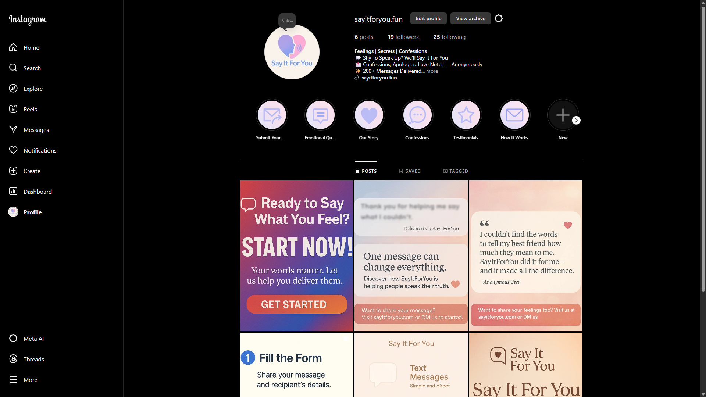
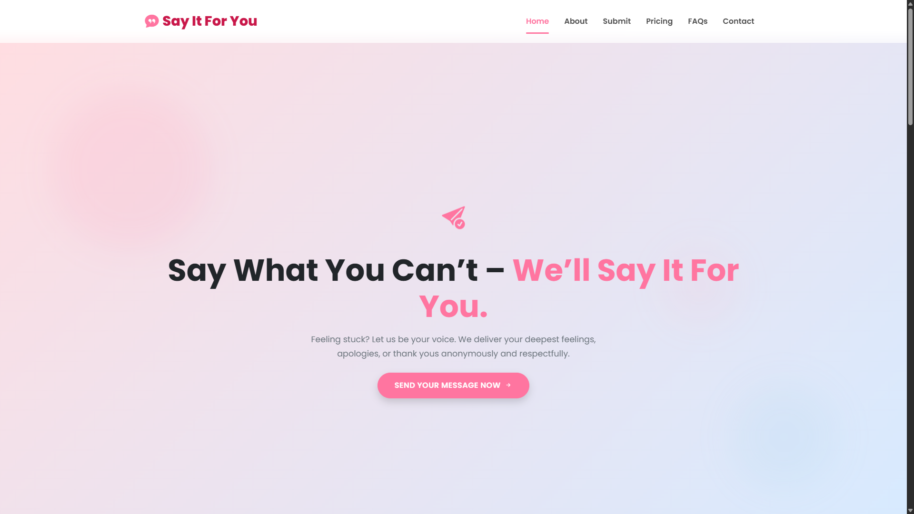

# SayItForYou.fun

*A curated platform delivering iconic movie quotes and high-quality wallpapers to engage and inspire fans through memorable storytelling.*

---

## About the Project

SayItForYou.fun is a proprietary web platform designed to showcase carefully selected quotes from popular movies, combined with visually striking 4K wallpapers and themed social media content. The project’s goal is to create an engaging, emotionally resonant experience for users who appreciate the power of cinematic storytelling.

This project is developed and maintained privately and is **not open for public collaboration**.

---

## Technical Overview

- **Frontend:** Built with HTML5, CSS3, and vanilla JavaScript for a clean and responsive user experience.
- **Content Management:** Static files optimized for ease of update and performance.
- **Design:** Minimalist and modern UI/UX focusing on content visibility and ease of navigation.
- **Deployment:** Hosted privately with controlled access (details confidential).

---

## Usage

This repository contains the codebase powering the SayItForYou.fun platform. Access is restricted to authorized personnel only.

---

## Connect and Follow

[]  
[@SayItForYou](https://www.instagram.com/sayitforyou.fun/)

[]  
[SayItForYou.fun](https://sayitforyou.fun)

---

## Confidentiality Notice

This project and its contents are confidential and proprietary. Unauthorized use, reproduction, or distribution is strictly prohibited.

---

*SayItForYou.fun — delivering stories through the power of quotes.*
